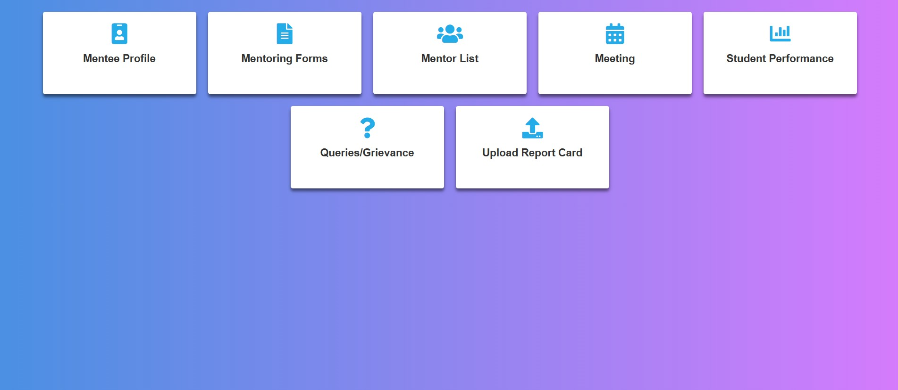
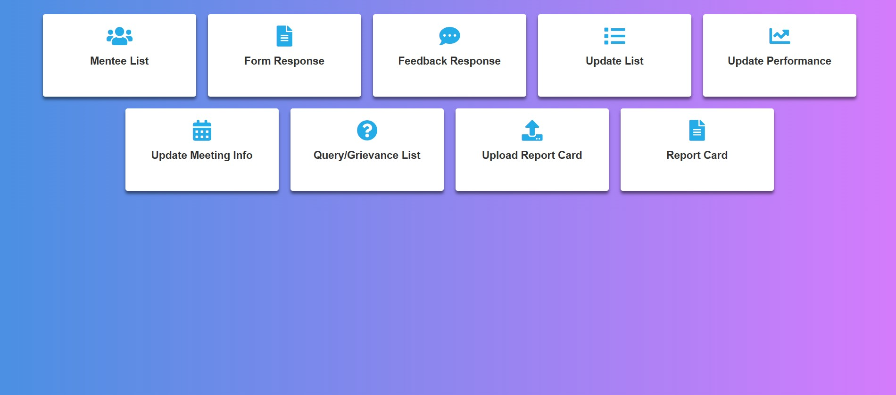

#  University Student Mentoring Platform

  
   
  

## 🌱 Overview
**Cultivating Growth: A Collaborative Journey Beyond the Classroom** is a comprehensive mentoring platform designed to facilitate connections between students, mentors, and parents through dedicated dashboards.

## ✨ Key Features

### 🔒 Secure Authentication
- Role-based access control 
- Encrypted password protection
- Session management

### 📊 Intelligent Dashboards

#### Mentor Portal
- Mentee group management
- Session scheduling
- Performance analytics
- Feedback system

#### Student Portal
- Mentor communication
- Resource library
- Progress tracking
- Assignment submission

## 🛠 Technology Stack

  
  
  
  
  
  
  

## 🚀 Quick Start

### Prerequisites
- Node.js v14+
- MongoDB (Atlas or local)
- Git

### Installation

# Clone repository
git clone [https://github.com/SAFAL-MONDAL/Mentoring_Website]

# Install dependencies
npm install

# Configure environment
cp .env.example .env

# Start development server
npm run dev
